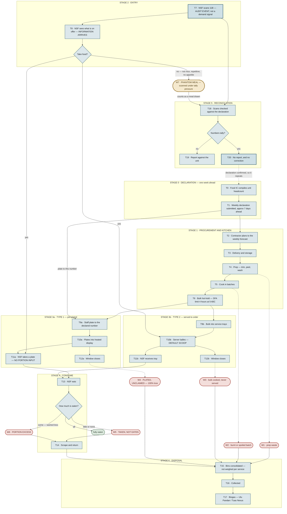

# Cookhouse food waste — touchpoint map

> **Why this file exists.** Mentor feedback, 4 Sep 2026:
>
> *"Map out specifically every single touch point of the cookhouse production to serving to leftovers and thrown away (both kitchen and NSFs). Then identify and pinpoint the problem and scale of the food waste problem. Once we have deeper clarity on this, we can then move into solutioning. A flowchart could be handy for now."*
>
> Maps the chain **before** picking a solution. Candidates stay in `00-master-plan.md` §7.

**Revision 2 — 4 Sep 2026.** Rev 1 had the forecast wrong. It treated the 11B scan as a demand measurement whose aggregate corrects the indent. It is not. **The scan is an audit against a headcount a unit declared a week earlier, and a mismatch gets the unit reported.** Everything downstream of that changed.

**Provenance tags:** `[testimony]` first-hand NS experience · `[cited]` public source, listed in §10 · `[weak]` forum or comment-sourced, treat as a lead not a fact · `[UNVERIFIED]` assumed, needs an interview.

---

## 1. The headline finding

The tally rule punishes a unit for declaring **too few** and for declaring **too many** `[testimony]`.

The unit's rational response is to make sure the numbers match: **people are told to scan their 11B whether or not they are eating** `[testimony]`.

That response is what breaks the system.

- **Under-declaring is instantly detectable.** People turn up and there is no food. Somebody complains that day.
- **Over-declaring is undetectable**, because the forced scans make the tally come out right anyway.

> **The control designed to catch forecast error is the mechanism that conceals it.** Both directions are punished on paper. Only one direction can actually be seen. So the error runs one way, permanently, and no one in the chain ever learns it happened.

MINDEF's public position is that the loop is closed:

> *"an electronic meal accounting system to track actual consumption patterns over time so that adjustments can be made to meals provided"* — [MINDEF PQ, 3 Feb 2020](https://www.mindef.gov.sg/news-and-events/latest-releases/03feb20_pq/) `[cited]`

The system exists and does what it says. **But what it records is compliance with a declaration, not consumption.** A scan under tally pressure is indistinguishable from a meal eaten. The adjustment loop is real and its sensor reads back the number it is supposed to be correcting.

That is also the honest explanation for the ~1% figure. **1% is not evidence that little food is wasted. It is evidence that the tally works.**

---

## 2. The full chain

**Read the loop at the bottom.** T20 is the trap: the numbers tally, nobody is reported, and the declaration that caused the over-production is confirmed as correct. It then repeats next week.

---

## 3. Touchpoints

| ID | What happens | Owner | Waste it creates | Measured today? |
|---|---|---|---|---|
| **T0** | Food IC compiles the unit's headcount | Food IC (an NSF) | drives W3, W4 | **No** — a guess `[testimony]` |
| **T1** | Weekly declaration, ~7 days ahead | Food IC → cookhouse | drives W3, W4 | **Yes** — the declared number `[cited]` |
| **T2** | Contractor plans to the weekly forecast | SATS / Foodfare | over-ordering | **Yes** `[cited]` |
| **T3** | Delivery and storage | Caterer | spoilage | Likely `[UNVERIFIED]` |
| **T4** | Prep — trim, peel, wash | Kitchen | W1 | **No** `[UNVERIFIED]` |
| **T5** | Cook in batches | Kitchen | W2 | **No** `[UNVERIFIED]` |
| **T6** | Bulk hot-hold — 4 hr limit at 5–60 °C | Kitchen | quality decay → W5 | **No** `[cited]` for the limit |
| **T7** | **NSF scans 11B — audit event** | Meal accounting | — | **Yes — the only instrumented point, and it measures compliance** `[cited]` |
| **T8** | NSF sees what is being served | — | — | **No** — not an event |
| **T9a** | Staff plate **to the declared number** | Kitchen | **W4** | **No** `[testimony]` |
| **T10a** | Plates under heat lamps | Kitchen | W4 | **No** |
| **T11a** | NSF takes a plate — no portion input | Diner | **W6** | **No** |
| **T12a** | Window closes on unclaimed plates | Kitchen | **W4 — 100% loss** | **No** `[UNVERIFIED]` |
| **T9b** | Bulk into service trays | Kitchen | W3 | **No** |
| **T10b** | Server ladles — default scoop | Server | **W6** | **No** |
| **T11b** | NSF receives tray | Diner | — | **No** |
| **T12b** | Window closes on remaining bulk | Kitchen | **W3** | **No** `[UNVERIFIED]` |
| **T13** | NSF eats | Diner | W5, W6 | **No** |
| **T14** | Scrape and return | Diner | W5, W6 | **No** |
| **T18** | Scans reconciled against declaration | Unit / cookhouse | — | **Yes** `[testimony]` |
| **T19** | Report against the unit if it doesn't tally | Chain of command | — | **Yes** `[testimony]` |
| **T20** | Tally matches — no report, **no correction** | — | **the whole problem** | — |
| **T15** | Bins consolidated | Cookhouse | — | Not per service or dish |
| **T16** | Collected | Waste contractor | — | Tonnage only `[UNVERIFIED]` |
| **T17** | Biogas treatment | NEA / Tuas Nexus | — | Aggregate `[cited]` |

> **Three points in this chain are instrumented: the declaration, the scan, and the reconciliation between them. All three measure the same number. None of them measures food.**

Everything between T8 and T15 — every point where the amount actually lost is decided — is unmeasured.

---

## 4. Where food is lost

| ID | Sink | Cause | Recoverable | Visible |
|---|---|---|---|---|
| **W1** | Prep waste — trimmings, peel | Kitchen, T4 | No — baseline | No |
| **W2** | Burnt / spoiled / dropped batch | Kitchen, T5 | No | No |
| **W3** | Bulk cooked, never served *(Type 2)* | T1 declaration | Maybe `[UNVERIFIED]` | No |
| **W4** | **Plated but unclaimed** *(Type 1)* | T9a, plated to the declared number | **No — 100% loss.** Past the 4-hour hot-hold limit it cannot be chilled, re-served or donated `[cited]` | No |
| **W5** | **Taken but not eaten** | The menu — not nice, repetitive, no appetite | No | No |
| **W6** | **Portion excess** — wanted less | T9a / T10b | No | No |
| **W7** | **Phantom meal** — scanned under tally pressure, never eaten | The tally rule at T18/T19 | n/a — **no food is lost here** | **Recorded as its own opposite** |

### W7 is not a food sink. It is the sink that hides the others.

The food for a phantom meal *was* cooked and *was* plated — that loss lands in W4 or W3. What W7 destroys is the evidence. A meal nobody ate is filed as a meal eaten, the tally comes out right, and the declaration that caused the over-production is confirmed correct for next week.

### W5 is new, and nothing in the current plan addresses it

`00-master-plan.md` §3 has Problem A (fixed portion) and Problem B (blind plating). Both concern **how much** food arrives in front of someone. W5 is about **whether they want it at all** `[testimony]`. **No plate size fixes food nobody wants to eat.** It belongs to the menu. Either size it or scope it out explicitly — do not leave it unnamed.

---

## 5. Pain points, ranked

| # | Pain point | Where | Feeds | Source |
|---|---|---|---|---|
| **P1** | **The tally punishes both directions, but only one is detectable.** Under-declare and people go unfed that day. Over-declare and forced scans make it tally anyway. The enforcement mechanism creates the blindness. | T18 → T19 | W3, W4, W7 | `[testimony]` |
| **P2** | **The forecaster never learns the error.** The food IC does not find out how much came back. A controller, an actuator, and no sensor wired back. | T0 ← nothing | W3, W4 | `[testimony]` |
| **P3** | **Weekly resolution against daily variance.** One number, seven days ahead, against duty rosters, outfield, bookout, MC, guard. Publicly acknowledged: headcount is *"fluid and unpredictable… owing to troop movements in and out"* | T1 | W3, W4 | `[cited]` + `[weak]` |
| **P4** | **Asymmetric risk drives over-declaration.** Reported publicly: *"suppliers would rather prepare more and potentially waste food, instead of preparing less and risk a food shortage."* | T0, T2 | W3, W4 | `[weak]` |
| **P5** | **The portion is fixed before the diner exists.** No input mechanism at any point in Type 1. | T9a, T11a | W6 | `[testimony]` |
| **P6** | **Plated food is unrecoverable.** Locked in at plating; past 4 hours it cannot be recovered at all. Fort Jackson: 83% of dining-facility waste from overproduction, not scrapings. | T9a → T12a | W4 | `[cited]` |
| **P7** | **Palatability drives waste and no portion mechanism touches it.** | T13, D2 | W5 | `[testimony]` |
| **P8** | **Nothing between T8 and T15 is measured.** | stages 2–4 | all | `[UNVERIFIED]` |

**P1 through P4 are all upstream of the servery, and none of them are Type 1 vs Type 2 problems** — they hit both configurations identically. That is an improvement on rev 1: one intervention upstream covers every cookhouse instead of only the pre-plated ones.

---

## 6. Where to intervene

Ranked on impact alone. Budget and hardware deliberately ignored.

**1 — Close the loop back to the food IC (T0).** The largest sinks are W3 and W4, both set at T1 by someone who has never been told they were wrong. The leverage is not a better forecast; it is the missing feedback wire. Make the error visible once and over-declaration stops being free.

Critically, **the food IC is a serviceman, not the contractor** — so this stays on the diner's side of the `00-master-plan.md` §4.1 line. It is not a management tool for the caterer; it is an instrument for a fellow NSF whose job currently requires guessing.

**2 — Plate to live demand instead of the declared number (T9a).** W4 is the only 100%-loss sink and the 4-hour clock is unforgiving. Fixes today's variance in minutes rather than the baseline over weeks. Complementary to #1: different timescale.

**3 — Portion choice (T11a).** Drains W6. Real, but if Fort Jackson's split holds, W6 sits in the 17% and W3+W4 in the 83%.

**4 — Menu (W5).** Possibly the largest ceiling, and immovable — contract-set and company-side.

### What is now ruled out, and why

**Do not build anything that depends on people choosing not to scan.** Rev 1 proposed showing the menu before the scan so a non-scan would become a true demand signal. **A non-scan gets the unit reported** `[testimony]`. That intervention punishes the person doing the right thing. Dead.

### What this does to the hardware

The load-cell rig does not die; its purpose changes. It stops being a portion-choice mechanism and becomes **the missing sensor in a control loop** — its output is not *"take a smaller plate"* but *"you declared 120, 94 were taken, 26 were binned,"* delivered to the one person whose weekly decision causes the waste and who has never seen that number.

---

## 7. Scale

**Established:**

| Figure | Value | Source |
|---|---|---|
| SAF cookhouses | ~60, commercialised 1997 | `[cited]` |
| Caterers | 2 — SATS Defence Catering (ex-SFIM) and Foodfare | `[cited]` |
| Forecast basis | **weekly** — *"cookhouse contractors will prepare meals based on the weekly forecast of servicemen who will be consuming those meals"* | `[cited]` |
| Stated food waste | ~1% of meals catered | `[cited]` |
| Hot-hold limit | **4 hours** at 5–60 °C, per SFA | `[cited]` |
| Overproduction share (US Army, Fort Jackson) | **83%** of waste | `[cited]` |

**Unknown, and how to get it:**

| Sink | Method |
|---|---|
| W1, W2 | Kitchen weigh-in. Needs contractor cooperation — out of reach this programme. |
| W3 | Ask how much bulk is left at window close. |
| **W4** | **Count plates left in the display at close.** Highest-value number available, and an NSF can observe it with no equipment. |
| W5 vs W6 | Cannot be separated by weight — both land in the same bin. The diner has to be asked *why*. |
| W7 | Ask directly: are you told to scan when you're not eating? |

> Every number that matters is obtainable by asking servicemen, and none of it by measuring anything — a direct consequence of the Green Zone photography ban (`00-master-plan.md` §4.2).

---

## 8. The commercial argument may be inverted — resolve this

`00-master-plan.md` §9 claims: *"food waste is a direct cost against contract margin, so the commercial incentive is aligned."* **That may be backwards, and it is load-bearing for the entire scale-up section.**

One unofficial account describes the contract as paying the caterer **per meal served**, with diner quality ratings factored into payment and liquidated damages if "Lousy" exceeds 20% `[weak — forum-sourced, treat as a lead only]`.

If that is even roughly right, the question becomes: **is "served" measured by the scan, or by a plate actually leaving the counter?** The scan is the only instrumentation in the building, so it is almost certainly the scan — and if so:

- The caterer cooks to the declared number and is paid against a scan count that tally pressure forces to equal it.
- **They are reimbursed in full for food nobody ate.** The waste is a cost to MINDEF, not to their margin.
- The commercial lever in §9 does not exist. The buyer to convince is the **procuring party**, not the caterer.

The quality-rating and liquidated-damages clause, if real, is a *different* and possibly better lever — it makes W5 (food nobody wants) directly expensive to the caterer in a way that binned food is not.

**This is the single highest-value thing left to verify.** GeBIZ / DSTA tender documents are the public route.

---

## 9. Interview questions, reprioritised

The map's questions now outrank most of `00-master-plan.md` §8. In order:

1. **Are people told to scan even when they're not eating?** ✅ *Confirmed once* `[testimony]` — needs 3–4 more to be safe to state publicly.
2. What exactly does the food IC declare — per meal, per day, or one weekly number? Can it be amended during the week?
3. What actually happens when it doesn't tally — who gets the report, and how bad is it?
4. Does the food IC ever find out how much was left over? ✅ *Confirmed: no* `[testimony]`
5. Does the cookhouse plate to the declared number? ✅ *Confirmed, hedged* `[testimony]`
6. Are plates left in the display at window close, and roughly how many?
7. When you don't finish, is it the food itself or your appetite?

---

## 10. Sources

| Claim | Source |
|---|---|
| Weekly forecast basis for cookhouse meal preparation | [MINDEF, 1 Feb 2018](https://www.mindef.gov.sg/news-and-events/latest-releases/01feb18_fr/) |
| Electronic meal accounting tracks consumption for adjustment; ~1% waste; biogas | [MINDEF PQ, 3 Feb 2020](https://www.mindef.gov.sg/news-and-events/latest-releases/03feb20_pq/) |
| 4-hour hot-hold limit at 5–60 °C per SFA; forecast review | [MINDEF, 22 Jun 2019](https://www.mindef.gov.sg/news-and-events/latest-releases/22jun19_fr/) |
| Headcount fluidity; over-preparation preferred to shortage `[weak]` | [Mothership, Feb 2018](https://mothership.sg/2018/02/saf-food-wastage-explained/) |
| 60 cookhouses commercialised 1997; SFIM (SATS) and Foodfare | [MINDEF archives, 1998](https://www.nas.gov.sg/archivesonline/data/pdfdoc/MINDEF_19980211001.pdf) |
| SATS Defence Catering operations | [SATS](https://www.sats.com.sg/media/careers-our-people/home-team-academy-cookhouse-food-services) |
| DEO cookhouse model | [DSTA](https://www.dsta.gov.sg/what-we-do/detail?title=redefining-cookhouse-concepts&category=pc) |
| Green Zone photography prohibited | [MINDEF PQ, 2 Oct 2017](https://www.mindef.gov.sg/news-and-events/latest-releases/02oct17_pq2/) |
| Fort Jackson — 83% overproduction | [EPA, 2019](https://cfpub.epa.gov/si/si_public_record_report.cfm?dirEntryId=346767&Lab=NRMRL) |
