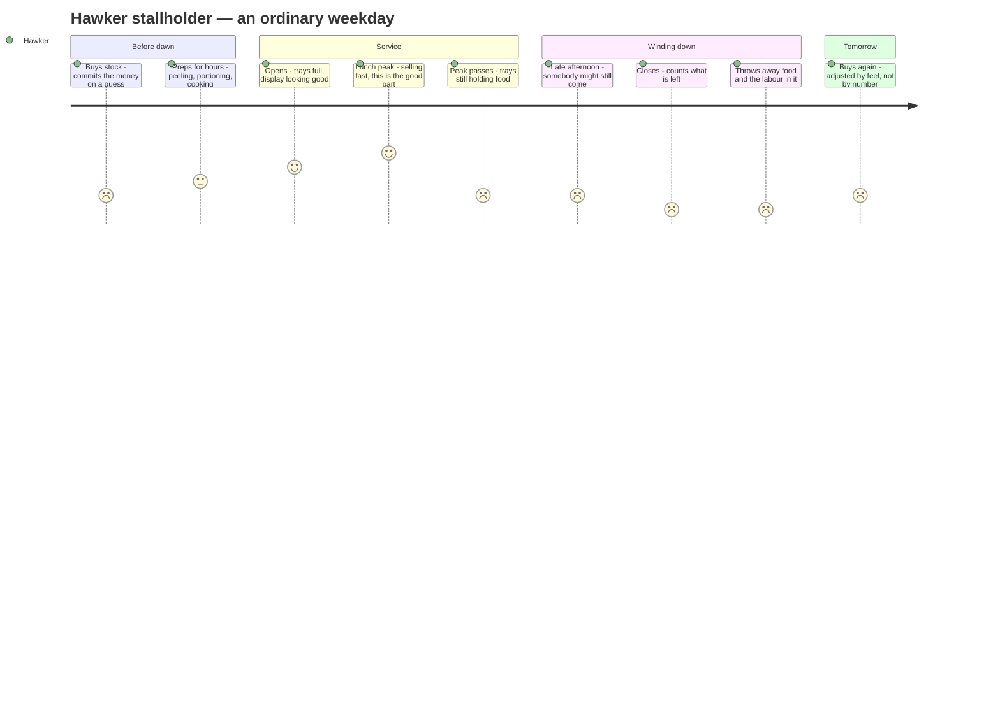

# Journey map — the hawker stallholder

> **Actor chosen: the stallholder, not the diner.** Reasoning in `03-hawker-5w1h.md` §8 — the diner feels no friction, and an intervention that fights an absence of pain is the hardest kind there is. The stallholder feels this **financially, every single day**.
>
> **Provenance.** `[cited]` public source (§7) · `[DERIVED]` implied by cited facts · `[ASSUMED]` needs fieldwork. **No `[testimony]` yet — no hawker has been interviewed.** §6 is how that changes.

---

## 1. Actor, scenario, expectations

**Actor.** An owner-operator of a cooked-food stall in an NEA hawker centre. Not a chain, not a food court unit, not a celebrity hawker. One or two people running the stall, most likely family labour.

**Scenario.** An ordinary weekday. Buy stock before dawn, prep, open, serve lunch, close.

**Expectations.** Sell out cleanly. Cover rent. Go home before collapsing.

**The thing that defines this persona:** they make a **demand forecast with their own money, every morning, before they know anything about the day.** Weather, weekday, nearby office turnout, a competing stall's closure — all unknown at the moment the money is committed.

---

## 2. The emotional curve

---

## 3. The detail

| Stage | Action | Channel | Thinking | Emotion | Core friction |
|---|---|---|---|---|---|
| **1 · The buy** | Wet market, wholesaler, butcher, supplier. Decides quantity | Pre-dawn, cash committed | *"How much will go today?"* | **Tense — highest financial exposure of the day** | **The single most consequential decision, made with the least information.** Not routine ordering — freshness, yield, and *"how much can realistically be sold that day"* are all judgement `[cited]` |
| **2 · Prep** | Peeling, washing, deboning, portioning rice and noodles, packing sauces | Back of stall, hours before opening | *"Get ahead of the rush."* | Neutral, laborious | **Every hour here is labour that gets thrown away with the food if it doesn't sell.** *"A stall that opens at seven cannot begin serious preparation at 6:55"* `[cited]` |
| **3 · Open** | Fills trays, sets the display | The counter | *"Looking full."* | Mild optimism | **A depleted tray deters customers.** Abundance is a sales tool — so the display is deliberately over-stocked `[ASSUMED]` |
| **4 · Peak** | Serves continuously, 60–120 minutes | The counter, no spare hands | *"Moving well."* | **Peak — adrenaline, the good part** | **Zero capacity for anything else.** No time to log, tap, weigh, or think. Any intervention landing here will be ignored |
| **5 · Post-peak** | Rush thins. Trays still hold food | The counter, watching | *"Still a lot left."* | **Dip — the anxiety starts** | The realisation arrives hours before the loss does, and nothing can be done about it now |
| **6 · The long tail** | Keeps the stall open. Occasional customers | The counter | *"Someone might still come."* | Uneasy, sunk-cost | **Staying open costs time; closing early admits the loss.** Some hawkers do close once sold out or once it is clearly dead `[cited]` |
| **7 · Close** | Counts what is left | End of service | *"All of this."* | **Valley** | **The only feedback of the entire day — and it is impressionistic.** Not weighed, not costed, not recorded `[ASSUMED]` |
| **8 · Discard** | Throws it, or takes some home | The bin, sometimes a segregation bin if the centre has a digester `[cited]` | *"Wasted."* | **Deepest valley** | **They are throwing away ingredients *and* their own labour.** Unlike a retailer, the hawker personally cooked what goes in the bin |
| **9 · Tomorrow** | Buys again, adjusted by feel | Pre-dawn | *"Bit less today."* | Reset, slightly wary | **The adjustment is intuition, not arithmetic.** Twenty years in, that intuition is good. Two years in, it is expensive |

---

## 4. How this actually affects the business

This is the part that matters for the pitch. The numbers are `[cited]`; the arithmetic combining them is `[DERIVED]` and clearly labelled as illustrative.

### The cost structure

| Item | Typical | Source |
|---|---|---|
| Stall rent, non-subsidised cooked food, median | **~S$1,250/month** (range S$500–3,000) | `[cited]` |
| Stallholders still on subsidised rent | **~40%** | `[cited]` |
| Incubation stall rent, first year | from **S$200/month** | `[cited]` |
| Also borne by the hawker | **Conservancy and table-cleaning charges**, excluding utilities | `[cited]` |
| Cost of goods sold | **30–35% of revenue** (target 25–30%) | `[cited]` |
| Gross margin | 50–60% | `[cited]` |
| **Net margin** | **10–15%** | `[cited]` |
| Owner income | S$2,000–10,000/month; S$10–20k in prime sites | `[cited]` |
| Wasted food, average food service setting | **5.6% of total sales** | `[cited]` |

### The calculation that makes the case

**Waste is a cost. Profit is what survives cost. So a dollar of binned food comes off the bottom line dollar for dollar — and at a 10–15% net margin, replacing it takes far more than a dollar of sales.**

> **At a 12% net margin, every S$1 of food thrown away needs roughly S$8 of additional sales to replace.**
>
> `1 ÷ 0.12 ≈ 8.3`

Worked through, illustratively `[DERIVED — assumptions stated, not measured]`:

| | |
|---|---|
| Daily revenue | S$1,000 |
| Net profit at 12% | **S$120** |
| Food discarded at close, at cost | S$50 |
| Share of that day's profit destroyed | **~42%** |
| Extra sales needed to recover it | **~S$417** |
| Over a 26-day month | **~S$1,300 — roughly a month's rent** |

**That framing is the whole business case.** A hawker who thinks of the bin as *"maybe fifty dollars of ingredients"* is under-counting by a factor of eight in the terms that matter to them. Nobody has ever shown them the number that way, because **nobody has ever measured what goes in the bin.**

### The asymmetry — and here it is genuinely different from the cookhouse

`01-problem-map.md` established that in a cookhouse, being short is loud and being over is silent. **For a hawker it is more balanced, and being honest about that is what makes the analysis credible.**

| | Running out early | Over-preparing |
|---|---|---|
| Lost marginal sales | **Yes** | No |
| Regular customer turned away | **Yes — the real cost** | No |
| Labour wasted | No | **Yes** |
| Ingredients destroyed | No | **Yes — at ~8× in sales terms** |
| Go home early | **Yes — a genuine benefit** | No |
| Signals popularity | **Yes — "sold out" is good marketing** | No |

**Some hawkers already play it the other way**, deliberately buying smaller quantities to run out cleanly `[cited]`. So over-preparation is not universal and must not be presented as if it were. **It is a strategy choice made without data** — and *that* is the finding, not "hawkers waste food."

### Why they cannot fix it themselves

- **No storage.** No space to buy in volume, so no wholesale pricing — many pay retail, which thins the margin further `[cited]`
- **No spare hands.** Stage 4 is continuous work. There is no moment in the day to record anything
- **No number.** The only feedback is a visual impression at close, which cannot accumulate into knowledge or be compared week to week
- **No benchmark.** Nobody can tell them whether their waste is normal, because no such figure exists for their dish, their stall, or their centre

---

## 5. The finding this map produces

**The stallholder makes two different decisions that create two different waste streams — and they only ever see one of them.**

| Decision | Where the waste lands | Do they see it? |
|---|---|---|
| **How much to cook** *(stage 1)* | Their own bin, at close | **Yes** — but only as an impression |
| **How much to put on a plate** *(stage 4)* | The diner's plate → the **table cleaner's** bin | **Never.** Different bin, different person, different building rules |

The second one is invisible to them **by the physical layout of a hawker centre.** A stallholder could serve consistently oversized portions for twenty years and receive not one signal about it, because the evidence is cleared by someone else, at a table they cannot see, into a bin they never open.

> **The hawker's own waste teaches them something, badly. The waste they cause in other people teaches them nothing at all.**

That is the gap — and it is a different gap from the cookhouse's missing feedback wire, which matters for keeping the two prototypes genuinely distinct (Jamie's second-S$200 test).

---

## 6. What must be verified — you have interviewed no hawkers

**Every emotional beat above is inferred.** Six questions, one afternoon, one hawker centre:

| # | Question | Tests | Why |
|---|---|---|---|
| **S1** | How do you decide how much to buy each morning? Has it changed over the years? | Stage 1 | The core decision. Expect *"by feel"* — confirm it |
| **S2** | What's left at the end of a normal day? Do you weigh it or cost it? | Stages 7–8 | **Confirms or kills the "no number" premise the whole map rests on** |
| **S3** | Would you rather run out early or have some left over? Why? | §4 asymmetry | **The most important question.** If they'd rather run out, over-preparation isn't the problem and this direction is wrong |
| **S4** | Do you ever hear how much customers leave on their plates? | §5 | Tests the invisible second stream |
| **S5** | If someone told you exactly what you threw away each day, in dollars, would you use it? | Whether the intervention has a buyer | A "no" here is worth more than a month of building |
| **S6** | What would make you stop using something new after a week? | Adoption constraints | The honest version of a feasibility question |

**S3 and S5 are the two that can kill this direction, which is exactly why they go first.** Ask them before anything gets built.

---

## 7. Design constraints this map imposes

Whatever gets built for this persona must survive the stage-4 test:

- **Zero interaction during service.** Peak is 60–120 minutes of continuous work with no spare hands. Anything requiring a tap, a log, or a decision then will be abandoned
- **Zero manual data entry, ever.** Not once a day, not once a week
- **Payback measured in weeks, not years.** They are on a 10–15% net margin and will not fund a science project
- **It must survive being ignored.** If it stops working when they get busy, it stops working precisely when it matters
- **It must produce a number in dollars, not kilograms.** Kilograms are an environmental unit. This persona buys in dollars, prices in dollars, and fails in dollars

**And the honest constraint:** the ~S$8-of-sales-per-S$1-wasted argument only lands if they believe the waste figure. That means the measurement has to be **theirs**, not yours — a number they trust because it came off their own stall, not a claim in a slide.

---

## 8. Sources

| Claim | Source |
|---|---|
| Median stall rent ~S$1,250/mo, range S$500–3,000; ~40% on subsidised rent; incubation stalls from S$200/mo; conservancy and table-cleaning borne by hawkers | [MSE — oral reply to PQ on hawker stall rentals](https://www.mse.gov.sg/latest-news/oral-reply-to-pq-on-hawker-stall-rentals/) · [NEA — measures to moderate hawker stall rents](https://www.nea.gov.sg/media/readers-letters/index/nea-has-put-in-place-various-measures-to-moderate-hawker-stall-rents) |
| Net margin 10–15%; gross 50–60%; COGS 30–35%; earnings ranges; location effect | [KitchenUnionSG — how much does a hawker make](https://kitchenunionsg.com/how-much-does-a-hawker-make-in-singapore/) · [SGWarrior — how much hawkers earn](https://sgwarrior.com/how-much-does-a-hawker-earn-singapore/) · [Stampede — how to start a hawker business](https://stampede.sg/blog/how-to-start-hawker-business-singapore) |
| Wasted food = 5.6% of sales in average food service setting; commercial food waste cost ~S$342m/yr | [Restroworks — Singapore restaurant food waste statistics](https://www.restroworks.com/blog/restaurant-food-waste-statistics-singapore/) |
| Pre-dawn prep; sourcing as judgement not routine ordering; absorbing cost fluctuations by buying less; physical cost of prep | [Forked Tongue — the hidden work before a hawker stall opens](https://forkedtongue.com.sg/work-before-hawker-stall-opens/) |
| Hawkers close once sold out; throwing away more when footfall drops; buying smaller quantities as a coping strategy | [Quora — do hawker stalls close early](https://www.quora.com/Do-hawker-stalls-in-Singapore-close-early) `[weak]` · [Malay Mail, Feb 2020 — hawkers see business plunge](https://www.malaymail.com/news/life/2020/02/23/wed-try-to-endure-singapore-hawkers-see-business-plunge-by-up-to-50pc-due-t/1839985) |
| Digesters and food waste segregation at hawker centres | See `03-hawker-5w1h.md` §11 |
| Journey map anatomy; emotion as a single line; the valleys are the design opportunities | [NN/g — Journey Mapping 101](https://www.nngroup.com/articles/journey-mapping-101/) · iDeA 1 method map |
