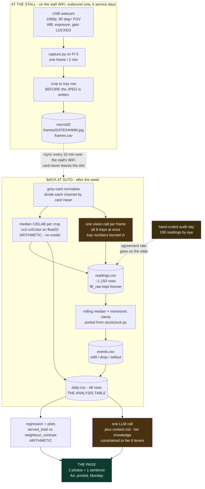
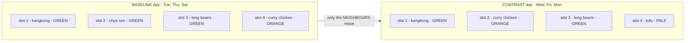
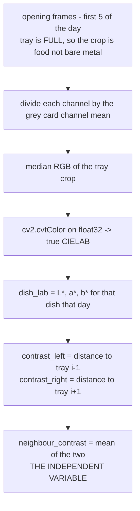
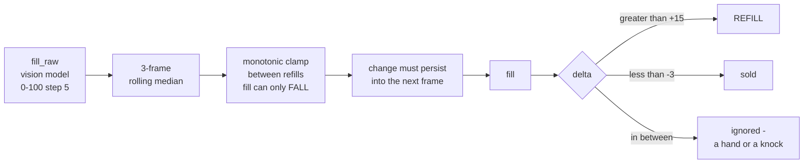
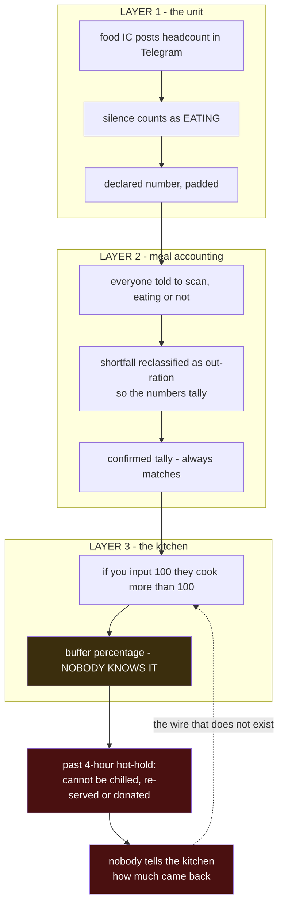
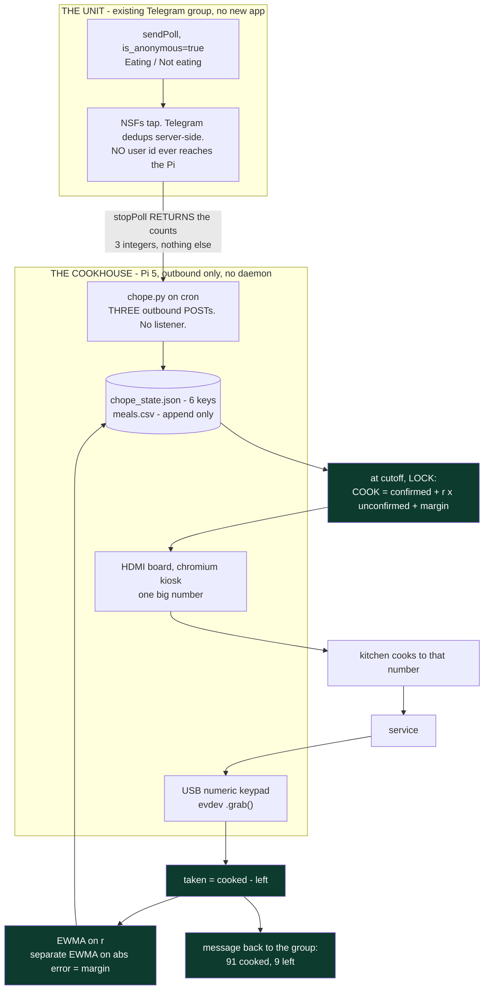
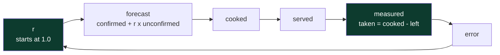

# Technical architecture — both prototypes

> Companion to `army prototype 1/08-chope-prd.md` and `hawker prototype 2/09-traywatch-prd.md`.
> The PRDs say *what* and *why*. This says *how it is wired*.
>
> **Provenance.** `[T1]` Raghav's own service · `[T2]` senior NSF interview, 4 Sep · `[T3]` stall owner
> and mentor, 17–18 Sep · `[VERIFIED]` tested on this machine, output reproduced in the text ·
> `[cited]` public source · `[ASSUMED]` still needs fieldwork.

---

## 0. The one architectural rule both prototypes obey

> **The LLM is never in the measurement path.**

In both systems a model may *read* an input or *write* the final advice. Nothing in between — no
derived metric, no aggregate, no comparison — is produced by a model. Every number on every slide is
arithmetic over a CSV that can be audited by hand.

This is not stylistic. It is the answer to the question a judge actually asks: *"how do you know that
number is right?"* If the honest answer is "the model said so," the entry has no measurement, it has
a vibe.

| | Model reads | Model writes | **Arithmetic only** |
|---|---|---|---|
| **Tray Watch** | tray fill, per frame | the weekly recommendation | deltas, refills, leftovers, ΔE, the regression |
| **Chope** | nothing | nothing | the forecast, `r`, the scoring |

**Chope contains no model at all.** It is a counter and a control loop. Worth saying out loud in a
hackathon full of teams bolting an LLM onto everything.

---

## 1. Tray Watch — physical layout

Oblique, roughly 40° above horizontal, mounted on top of the sneeze guard on the customer side,
looking down and across the tray row. **Not bird's-eye** — from directly overhead you see area
covered, not depth, and depth is most of the volume. A tray with 2 cm of food and one with 6 cm look
nearly identical from above.

```
                    ┌─── USB extension, 3 m ───────────────┐
                    │                                      │
        webcam ◄────┘                                 ┌────▼─────┐
          ╲  ~40°                                     │  Pi 5    │  on a shelf,
           ╲                                          │  2 GB    │  off the hot
            ╲                                         │ capture  │  greasy counter
   ══════════╲══════════  sneeze guard                └──────────┘
              ╲
               ▼  field of view — cropped to the row before any write
    ┌────┬────┬────┬────┬────┬────┬────┬────┐  ┌──┐
    │ 1  │ 2  │ 3  │ 4  │ 5  │ 6  │ 7  │ 8  │  │▓▓│ ← grey card, permanently in frame
    └────┴────┴────┴────┴────┴────┴────┴────┘  └──┘
      the display trays — cooked food, for sale
```

**Why the grey card is not optional.** The manipulated variable is colour. A webcam's auto white
balance re-corrects colour every frame, and canteen light changes between 11am and 3pm and between
days. Without a fixed reference in frame, the experiment measures the lighting. Every frame is
normalised by the card's channel means before anything else happens — three lines of code and a piece
of printed paper.

---

## 2. Tray Watch — data flow



**The two amber boxes are the only model calls in the system.** Everything between them is
arithmetic. Cut both out and you still have depletion curves, refill events and leftover figures — you
just have to read the fill levels by eye, which is exactly what the audit day proves is possible.

---

## 2.5 The clock — the failure that quietly eats the project

**This was missing from the plan entirely, and it invalidates every timestamped finding.**

The sharpest single output of this project is *"stop topping up tray 4 after 1:30pm."* That sentence
is worthless if the Pi does not know what time it is. The stall has WiFi, so it will — **but only
after NTP has yanked the clock backwards, and that yank is what quietly deletes frames.**

### What actually happens at boot

**Revised 19 Sep: the Pi has internet at the stall** `[T4]`. That removes the easy failure and leaves
the dangerous one — and makes the dangerous one *routine*.

The Pi 5 **does** have a hardware RTC, inside the PMIC. **It does not ship with the battery.** So at
every power-up the clock starts at the time of last shutdown, restored by `fake-hwclock`.

- **Without a network** that wrong time simply persists. Bad labels, recoverable offline.
- **With a network**, `systemd-timesyncd` associates a few seconds into the boot and **steps the clock
  backwards** to the truth. Correct time, *discontinuous* time — and the discontinuity is what eats
  frames.

> The network does not make the clock safe. It makes the one failure that destroys data go from
> *never* to *every single morning*.

### The failure is worse than wrong labels — it destroys data

Filenames in the plan are `frames/YYYY-MM-DD/HHMM.jpg`. Two concrete failures:

| | What happens | With internet |
|---|---|---|
| **Clock never corrected** | Tuesday's service is filed under Monday's date at Monday's times. The late-refill finding points at the wrong hour | **Solved.** NTP sets it at boot |
| **NTP steps the clock backwards** | Every subsequent filename collides with one already on disk, `imwrite` overwrites it, **no error**, frames gone | **Now the routine case.** It happens at every boot, before or during frame 1 |

### The fix — two layers, both free, both now mandatory

**Layer 1 — free, and strictly more robust than the RTC.** Make the filename immune to the clock, and
record two clocks side by side.

```python
import time, os, cv2
SEQ  = 0
BOOT = time.clock_gettime(time.CLOCK_BOOTTIME)   # seconds since boot. Never jumps, never reverses.

def save(img, day_dir, writer):
    global SEQ
    SEQ += 1
    wall, mono = time.time(), time.clock_gettime(time.CLOCK_BOOTTIME)
    path = os.path.join(day_dir, f"{SEQ:05d}.jpg")        # SEQUENCE, not the clock
    cv2.imwrite(path, img, [cv2.IMWRITE_JPEG_QUALITY, 85])
    writer.writerow([SEQ, f"{wall:.0f}", f"{mono - BOOT:.1f}",
                     time.strftime("%F %T", time.localtime(wall)),
                     path, os.path.getsize(path)])
```

Ordering now comes from `SEQ`, which cannot collide or reverse. **True wall-clock time comes from one
known anchor plus elapsed monotonic seconds:** photograph your phone's clock as the first frame of
each service, then offline `true_time = phone_time_at_seq1 + (mono − mono_at_seq1)`. The Pi's
oscillator drifts seconds per day — irrelevant across a six-hour service. **This alone rescues every
timestamped finding**, and it costs nothing.

**Layer 2 — free, and now permanent rather than a sixty-second hotspot.** The stall has internet `[T4,
19 Sep]`, so `systemd-timesyncd` runs continuously. The gate below is what stops the backward step
landing *inside* the capture run — it makes capture wait for the correction instead of being cut in
half by it. **With a network this unit gate is mandatory, not optional:**

```ini
[Unit]
After=time-sync.target
Wants=time-sync.target
```
plus `sudo systemctl enable systemd-time-wait-sync`, and store the stall's WiFi once with
`nmcli device wifi connect "<SSID>" password "<pw>"` so it reassociates itself every morning with
nobody present. **Check on day 1 and never assume it:** `timedatectl` must say
`System clock synchronized: yes`. A captive portal — common in a canteen — will silently fail this,
and the failure looks identical to success until you open the frames.

**~~Layer 3 — RTC backup battery, ~S$8.~~ Struck, 19 Sep.** It bought exactly one thing: a plausible
clock at boot with no network. There is a network, NTP does that for free, and **nothing should be
sent to the mentor that a working WiFi connection already handles.** The J5 connector, the JST-SH
1.0 mm cell and the `dtparam=rtc_bbat_vchg` line are all real and all now pointless here. −S$8.

**Layer 1 is not optional and never was.** It survives a clock that is wrong *but running*, which the
RTC never did — and on a networked Pi it is the only thing standing between you and a filename
collision at 11:02 every morning. **The network removed the reason for layer 3 and increased the need
for layer 1.**

---

## 2.6 Capture-time median — kills hands, ladles and steam at once

The occlusion that matters is **not** the constant kind. At 40° the far trays are foreshortened and
their lips clipped by the near trays' rims — but that geometry is *identical in every frame*, and
every dependent variable here is a **delta**. Constant foreshortening cancels. Do not spend budget
fighting it.

What does not cancel is **transient** occlusion: a hand, a ladle, a stack of plates, a customer
leaning in, a wisp of steam. One change at capture time removes all of them:

```python
def grab_median(cap, n=3, gap=2.0):
    """Median of n frames ~gap seconds apart. Hands, ladles and steam are
    transient across 4 s. Food is not."""
    out = []
    for i in range(n):
        if i: time.sleep(gap)
        for _ in range(5): cap.grab()      # flush the UVC buffer or you get a stale frame
        ok, f = cap.retrieve()
        if ok: out.append(f)
    return np.median(np.stack(out), axis=0).astype(np.uint8)
```

Still one JPEG on disk. ~4 s extra per 120 s cycle, negligible CPU, no change to USB current.

**Untreated, every occlusion becomes a phantom refill** — tray drops to 20% because an arm is across
it, then "refills" to 60% two minutes later — and refill detection is the sharpest output in the
project. Belt and braces: have the vision call return an `obscured` boolean per tray as well, and drop
those readings rather than smoothing them.

**Two grey cards, not one.** An eight-tray row is lit by more than one lamp; a single card at one end
bakes a light gradient into the colour measurement. One at each end lets you interpolate the gain
across the row. It is the cheapest item on the list and it protects the actual experiment.

**Mount on the customer side of the glass, looking back and down** — the glass then works as a steam
*and* grease shield. A lens mounted inside, above hot food, is filmed over in three days. Tilt ~5° off
the glass normal to kill the reflection of your own housing, and lock focus too
(`focus_automatic_continuous=0`) or autofocus hunts on steam and re-frames the shot each time.

---

## 3. Tray Watch — the experiment, drawn

The critique of any one-week study is *three days against three days proves nothing*. That critique
kills a **binary** before/after. It does not apply here, because the independent variable is
continuous and every dish has one every day.



> **The vegetable dishes never move.** Kangkong is in slot 1 on all six days. What changes is what
> sits beside it.

That is the whole trick, and it is what a position experiment structurally cannot do: move the dish
and you have changed two things at once, and six days will never tell you which one mattered.

| | Position experiment | **This** |
|---|---|---|
| Dish moves | yes | **no** |
| Confounds position with colour | **yes, fatally** | no |
| Independent variable | binary, 3 vs 3 | **continuous, 48 points** |
| Computable from the photos | no | **yes — ΔE** |

**The honest limitation, stated on the slide:** rearranging the neighbours also moves the *meat*
dishes, and where a popular dish sits changes where the queue slows down. Not separable in six days.
Say so rather than pretending the contrast effect is clean.

---

## 4. Tray Watch — how `neighbour_contrast` is computed



**Colour is measured at open, not continuously.** As a tray empties, stainless steel shows through and
drags the median toward grey — a real confound, avoided for free by fixing the measurement at the one
moment the tray is guaranteed full.

### 4.1 `PIL.Image.convert("LAB")` is a trap — do not use it `[VERIFIED]`

The plan's §3.2 says *"`PIL.Image.convert("LAB")`, no new dependency."* **That line is wrong and has to
change.** It does not raise an error, which is exactly what makes it dangerous.

Measured on this machine against textbook sRGB→CIELAB reference values:

| Method | worst-case error | error on **green** |
|---|---|---|
| `PIL.convert("LAB")`, decoded the obvious way (`byte − 128`) | **ΔE ≈ 180** | ΔE 188 |
| `PIL.convert("LAB")`, decoded correctly (signed byte) | ΔE 12.3 | ΔE 7.5 |
| **`cv2.cvtColor(float32, COLOR_BGR2LAB)`** | **ΔE 2.5** | **ΔE 0.01** |

Two separate problems:

1. **Pillow stores a\* and b\* as signed bytes, not offset by +128.** That is undocumented and the
   opposite of what every tutorial assumes. Decode it the obvious way and the error is *larger than
   the entire real range of the measurement* — and the numbers still look plausible. The experiment
   would produce pure noise and nobody would catch it.
2. **Even decoded correctly, Pillow is worst on green** — ΔE 7.5, against a real between-dish signal
   of perhaps ΔE 20–40. That is the one colour a vegetable experiment cannot afford to be sloppy
   about.

**Use OpenCV, which `capture.py` already imports for the webcam.** No new dependency either way, and
two orders of magnitude more accurate on the colour that matters.

```python
# Dish colour in true CIELAB units. cv2 is already a dependency for the webcam.
def dish_lab(crop_bgr_u8, card_mean_bgr):
    """Median CIELAB of a tray crop, grey-card normalised. L* 0..100, a*/b* approx -128..127."""
    norm = np.clip(crop_bgr_u8.astype(np.float32) / card_mean_bgr * 0.5, 0, 1)
    lab  = cv2.cvtColor(norm, cv2.COLOR_BGR2LAB)      # float32 in -> true CIELAB out
    return np.median(lab.reshape(-1, 3), axis=0)      # (L*, a*, b*)

def delta_e(lab1, lab2):
    """CIE76. Euclidean distance in LAB is perceptually uniform; in RGB it is not."""
    return float(np.linalg.norm(np.asarray(lab1) - np.asarray(lab2)))
```

### 4.2 The second trap in the same call — 8-bit packing

`cv2.cvtColor` **must** be handed `float32` scaled 0–1. Hand it `uint8` and you silently get the 8-bit
packed form instead. Same function, same name, different units, no error:

| channel | true range | packed as `uint8` | one count equals |
|---|---|---|---|
| `L*` | 0 … 100 | `L × 255/100` | **0.392 L\*** |
| `a*` | −127 … +127 | `a + 128` | 1.0 a\* |
| `b*` | −127 … +127 | `b + 128` | 1.0 b\* |

**Take a Euclidean distance on the raw packed triple and the L axis is stretched 2.55× relative to a\*
and b\*.** Every ΔE would then be dominated by *brightness* — which across a stainless tray row is
dominated by which lamp a tray sits under, not by what is in it. **The "colour contrast" experiment
would be measuring the lighting rig.** Convert to real units first, then subtract. Either path is fine
as long as you rescale:

```python
# if you use the uint8 path, you MUST undo the packing before any distance
L, a, b = np.median(lab8.reshape(-1, 3), axis=0)
lab = np.array([L * 100.0 / 255.0, a - 128.0, b - 128.0])
```

**One thing absolute LAB cannot do.** A webcam does not emit sRGB — it emits whatever its ISP produces
with WB locked. So absolute `L*a*b*` values are not meaningful in themselves. *Differences between two
dishes in the same frame* are, because both went through an identical pipeline. The independent
variable is a difference, so this is fine — but **never compare a ΔE from Monday against one from
Thursday unless the grey cards did their job.**

---

## 5. Tray Watch — the noise chain

Ported straight from `archive/stockclock.py`, which solved the identical problem for load cells. The
shape of the noise is the same; only the sensor changed.



| `stockclock.py` | Tray Watch | Why |
|---|---|---|
| `statistics.median` over `SAMPLES = 15` | 3-frame rolling median | single-frame model errors |
| `MIN_CHANGE_G = 20` | `MIN_DROP = 3` fill points | *"smaller than this is a knock or a hand, not stock"* |
| `SETTLE_SECONDS = 2.0` | must persist into next frame | a serving spoon in shot |
| weight up = new batch | `REFILL_JUMP = 15` | she tops trays up mid-service |
| — | **monotonic clamp** | **new prior the load cells did not have** |

The monotonic clamp is free accuracy: food does not appear in a tray except when someone refills it,
so upward drift below the refill threshold is model error *by definition* and can be discarded without
a judgement call.

**`fill_raw` is never overwritten.** It sits beside `fill` in the same CSV. If a judge asks how much
the filter changed the data, the answer is a column diff, not a shrug.

---

## 5.5 The statistics — the unit of analysis is the dish, not the dish-day

> ### ⚠ CORRECTED 21 Sep. This section retired the day-level test for a floor p of 0.10 — and then
> ### made the same mistake one level down. Read this box before the section below it.
>
> **The "n = 8 dishes, floor p = 0.0078" claim below is wrong.** A dish that MOVED has position
> confounded with contrast, so only **never-moved, re-neighboured** dishes carry contrast
> information. Exhaustive over all 40,320 rearrangements of an 8-tray row `[MEASURED, 21 Sep]`:
>
> | trays | max never-moved AND re-neighboured | best possible p | |
> |---|---|---|---|
> | 8 | **5** | **0.0625** | **above 0.05 — unwinnable at any outcome** |
> | 9 | 6 | 0.0312 | winnable in principle |
>
> Shuffling a row of 8 always costs three dishes as movers. **And at n=8, ignoring that, the test
> detects a real +10% effect 10% of the time and a real +20% effect 30% of the time.**
>
> **Consequence:** the rearrangement is a *side arm* reporting an effect size and CI, never a
> p-value, and the prototype leads with the waste ledger instead. `hawker prototype 2/design_checks.py`
> proves all of it in ~30 s; `09-traywatch-prd.md` §"What six days can and cannot prove" carries the
> rebuilt argument. **The maths below is retained because it is correct maths on the wrong n** — and
> because a retired claim that quietly vanishes is how the first version of this mistake survived.

**The plan's headline analysis is weaker than it looks, and this changes it.**

`05` §3.4 proposes `served_total ~ neighbour_contrast + dish fixed effects` across 48 dish-days. On
paper that leaves 40 residual degrees of freedom. **It has nowhere near 40 units of information.**
Arrangement changes on alternate days, so day-level effects — rain, exam week, payday, a school
holiday — are confounded with treatment *at the day level*, and there are only six days.

Add day fixed effects to fix the confound and you expose the real problem:

> With a binary arrangement over six days, there are only `C(6,3) = 20` distinct day-level
> assignments. A day-level randomisation test therefore has a **floor p-value of 2/20 = 0.10.**
> **It can never reach 0.05, no matter how strong the effect is.**

Do not build the headline on it.

### The test to run instead — exact, and six lines of numpy

**Unit of analysis = the dish.** Within each dish, difference its three high-contrast days against its
three low-contrast days. That removes dish identity, dish popularity, tray size and position
*entirely* — they are constant within a dish by construction, which is the whole point of the
never-move design. Then enumerate all `2⁸ = 256` sign flips. Exhaustive, so the p-value is exact.

```python
import numpy as np, pandas as pd
from itertools import product

d    = pd.read_csv("daily.csv")
piv  = d.pivot_table(index="dish", columns="arrangement",
                     values="served_total", aggfunc="median")
diff = piv["contrast"] - piv["baseline"]                 # one per dish

# A cai png roster rotates. A dish that missed an arrangement arm gives NaN, and the
# UNGUARDED version of this reported p = 0.0000 -- PERFECT significance out of a hole,
# because abs(null) >= abs(nan) is all-False. Drop them BY NAME, loudly, and refuse to
# run when too few are left to reach 0.05 at all.  [MEASURED, 21 Sep: design_checks.py C3]
dropped = diff[diff.isna()].index.tolist()
if dropped:
    print(f"DROPPED {len(dropped)} dish(es) missing an arrangement arm: {dropped}")
diff = diff.dropna().values
n    = len(diff)
assert n >= 6, (f"only {n} complete dishes; floor p = {2/2**n:.4f} > 0.05, so this test "
                f"cannot reach significance whatever the data says. Report the effect "
                f"size and CI instead -- see design_checks.py C1.")

obs  = diff.mean()
null = np.array([(s * np.abs(diff)).mean() for s in product([-1, 1], repeat=n)])
p    = float(np.mean(np.abs(null) >= abs(obs)))          # exact, two-sided

assert len(null) == 2**n and p >= 2/2**n and not np.isnan(p)
print(f"mean within-dish difference = {obs:+.1f} fill-points over n={n}, exact p = {p:.4f}")
```

**Even when this runs clean, it is reported as exploratory.** At the n this design can actually
reach, the p-value is not the claim — the effect size and its interval are.

| | Floor p | Can it reach 0.05? |
|---|---|---|
| Day-level randomisation test | 0.10 | **never** |
| Wilcoxon signed-rank, n=8 | 0.0078 | yes, but it discards magnitude |
| Sign test, n=8 | 0.070 at 7/8 | **no** |
| **Sign-flip permutation, n=8** | **0.0078** | **yes — 8/8 gives p=0.008, 7/8 lands near 0.02–0.05** |

**No scipy needed.** Keep the fixed-effects slope as a *descriptive effect size only* — fill-points per
unit ΔE — and never as the significance claim.

### The plot: one figure, two panels

- **Left** — eight sparklines, one per dish, `served_total` across six days, contrast days as filled
  markers and baseline as hollow, each dish on its own y-scale.
- **Right** — the eight within-dish differences as a dot plot against a zero line. **The right panel
  *is* the result**; a reader counts dots either side of zero in two seconds.

**Do not plot the pooled 48-point scatter.** It invites the reader to read a cross-dish slope that is
mostly dish identity.

### The claim, written out, and the four things it does not support

> At this stall, across six service days, *k* of 8 dishes sold more on the days they sat beside a
> higher-contrast neighbour. The mean within-dish difference is *X* fill-points, exact p = *p* over
> all 256 sign assignments. **This is evidence that display contrast is worth testing properly — not
> a measured effect size.**

1. **Not causal.** Arrangement was hand-assigned and alternated, not randomised. The permutation
   p-value is what you *would* have got under randomisation — a benchmark, not a guarantee.
2. **Contrast is still not cleanly separated from position.** Rearranging neighbours moves the meat
   dishes, and where the popular dish sits changes where the queue stalls. Six days cannot separate
   them. The statistics must not paper over the weak point the plan already admits.
3. **No transfer.** One stall, one menu, one lighting rig, six days.
4. **`served_total` is itself an estimate** — derived from model-read fill levels, with error
   correlated within a day (same light, same model). The test treats it as observed. **Report the
   audit-day agreement rate next to every p-value.**

---

## 6. Chope — the problem, drawn

Chope's architecture only makes sense against the shape of the failure `[T2]`.



> **Nobody in this chain is making a mistake. Each of the three is correctly solving the problem in
> front of them. The waste is what the three correct answers add up to.** — `02-journey-maps.md`

All three layers exist because of one asymmetry:

| | Under-supply | Over-supply |
|---|---|---|
| Detected? | **immediately** — someone is hungry | **never** |
| Recoverable? | **yes** — the kitchen cooks more | **no** — past hot-hold it is gone |
| Costs whom? | the kitchen: stress, a visible failure | nobody who can see it |

**The system has a remedy for the recoverable failure and none for the irreversible one.** That is
exactly backwards, and it explains the buffer completely. The buffer is not carelessness — it is the
rational purchase of insurance against the only failure anyone will notice.

**Chope does not shrink the buffer. It builds the missing wire** — the dotted line above — so the
kitchen can shrink it themselves without being reckless.

---

## 7. Chope — data flow



**Half A** is the poll — better headcounting. **Half B** is the green path: scoring every meal and
feeding the result back, at both ends. Half A is what the senior's critique kills as symptom-level
`[T2]`. **Half B is the level-4 answer, and the pitch leads with it.**

### 7.1 The privacy claim is enforced by Telegram, not by our code

The original design was a three-button inline keyboard. **Every `callback_query` carries `from.id`** —
so "counts only, never names" would have been a promise about our code, made to the one audience least
willing to take that on trust. The native anonymous poll removes the question entirely:

| | Inline keyboard + callback | **Native anonymous poll** |
|---|---|---|
| Does a `user_id` reach the Pi? | **yes, on every tap** | **no — there is no code path** |
| One-vote-per-person | you write it | **Telegram enforces it server-side** |
| Lines of code | ~80, plus the privacy problem | **~9** |
| Update mechanism needed | long polling or webhook | **none — `stopPoll` returns the counts** |
| The claim | a promise about our code | **a property of Telegram's servers** |

`sendPoll` defaults to `is_anonymous=true`; the `poll_answer` update fires only for *non-anonymous*
polls, so it is never sent at all. **The entire input to the forecast is three integers.**

**A salted hash was considered and rejected.** Under the PDPC's *Guide to Basic Anonymisation*,
pseudonymised data is still personal data — and in a 90-person group an attacker enumerates 90 user
IDs and rebuilds the table in a second. It buys nothing and costs the clean claim.

**The price, stated honestly:** *"Same as last week"* is per-person state and is therefore impossible.
It is cut. So are individual non-replier nudges. **Both losses are in Half A** — the half the critique
already kills.

**And no update loop is needed at all.** A webhook needs a public HTTPS endpoint on port 443/80/88/8443
— impossible behind NAT, and a listening socket on a defence network is a conversation you do not want
to have. `getUpdates` needs no inbound port. But this design needs neither: three outbound POSTs on
cron, and `stopPoll` hands back the final counts.

---

## 8. Chope — the control loop

The whole product in one diagram. Today the loop has an actuator and no sensor.



**`r` starts at 1.0 on purpose.** At `r = 1.0` the forecast is *confirmed + all unconfirmed* — which is
exactly today's behaviour, because silence already counts as eating `[T2]`. So day one reproduces the
current number and **carries no risk of running short.** `r` only falls as real meals are measured.

That property is the reason a kitchen would agree to try it. A forecasting tool that might under-call
on day one is a tool no cookhouse will ever install.

### 8.1 The estimator and the safety margin must be separate state

**This was got wrong twice, independently, before it was got right** — once by me and once by the
research agent, both reaching for an asymmetric learning rate (learn down slowly, up fast) because it
*feels* safer.

**It is not safer. It converges to the wrong number.** Noise above the mean is amplified and noise
below it is damped, so `r` settles biased high — measured at **+0.087 above the truth**, and it never
recovers. The second failure is subtler and I hit it directly: **fold the safety margin back into the
estimator and it compounds every cycle**, re-clamping to 1.0 forever, so `r` never moves at all.

> **`r` estimates the truth. The margin carries the safety. Separate jobs, separate state, separate
> knobs.** Tune one through the other and every attempt to fix one wrecks the other.

```python
ALPHA        = 0.25   # symmetric EWMA on r. ~12 meals to settle, no oscillation.
STOCKOUT_ERR = 2.0    # a stock-out widens the margin; it decays back over ~10 meals
R_FLOOR      = 0.50   # never assume fewer than half the silent turn up
MARGIN_K     = 2.0    # margin = 2 x EWMA(|forecast error|), minimum 3 portions

def score(s, confirmed, unconfirmed, cooked, left):
    taken = cooked - left
    s["err"] += 0.30 * (abs(taken - s["base"]) - s["err"])    # margin's own estimator
    if unconfirmed <= 0:
        return                                                # no info about r. Leave it alone.
    obs = min(1.0, max(0.0, (taken - confirmed) / unconfirmed))
    if left == 0:                          # ran out: demand was CENSORED, true demand >= taken
        s["r"]   += ALPHA * max(0.0, obs - s["r"])            # can ONLY be evidence r is higher
        s["err"] += STOCKOUT_ERR
    else:
        s["r"]   += ALPHA * (obs - s["r"])
    s["r"] = min(1.0, max(R_FLOOR, s["r"]))
```

**The censoring rule is the safety property.** When a meal runs out, `taken` is not demand — it is a
lower bound on demand, because you cannot observe the people who wanted food after it was gone.
Treating it as an observation would teach `r` that demand was *lower* than it really was, and the next
meal would run short too. The one-sided update makes a stock-out able only ever to push `r` **up**.

> `ponytail:` one-sided EWMA on censored observations. Upgrade to a Tobit update if a pilot ever
> produces >5% stock-out meals.

**Verified** `[army prototype 1/forecast.py`, `python forecast.py]`: 200 meals, mean `r` = 0.720
against a true 0.72, 2 stock-outs, converges inside ~12 meals, survives a 0.40 → 0.95 regime shift
with zero stock-outs after the third meal.

### 8.2 The margin is the whole trade, and the table is the honest artifact

| `MARGIN_K` | portions not cooked | stock-outs per 80 meals |
|---|---|---|
| 1.0 | 6.6% | 5.2 |
| 1.5 | 5.6% | 3.5 |
| **2.0 — shipped** | **4.6%** | **2.0** |
| 2.5 | 3.5% | 0.8 |

**Put this on the slide.** It is the most credible thing the prototype has, because it shows the design
admitting its own cost instead of quoting one flattering number. The measured end-to-end result is
correspondingly modest and should be stated that way: **2.7% steady-state against the indent, with the
learning period costing more than it saves** — and the baseline excludes the kitchen buffer on top,
which is K1, unmeasured, and the larger prize.

---

## 9. What is deliberately absent from both

| Not present | Why |
|---|---|
| **Any server, cloud or hosted backend** | Both run on hardware already owned. Nothing to pay for, nothing to keep alive after 2 Oct |
| **Any inbound network port** | Both are outbound-only. Chope POSTs to Telegram on cron; Tray Watch pushes frames with `rsync` and accepts nothing. **A networked box is not a listening box** |
| **Any database** | Tray Watch's whole week is ~1,400 rows of CSV. Chope's state is one JSON file |
| **Any login, account or user table** | Neither system has users in the software sense |
| **Any camera in Chope** | SAF cookhouses are Green Zone — unauthorised photography is an offence `[cited]` |
| **Any model in Chope** | It is a counter and a control loop |
| **Any training** | A vision API call handles lighting, steam and glare with zero labelling. With 13 days, training anything is how this fails |
| **Any live analysis at either site** | A live demo that fails in front of a judge is worse than no live demo |
