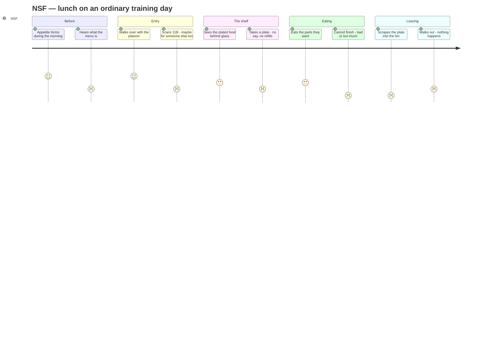
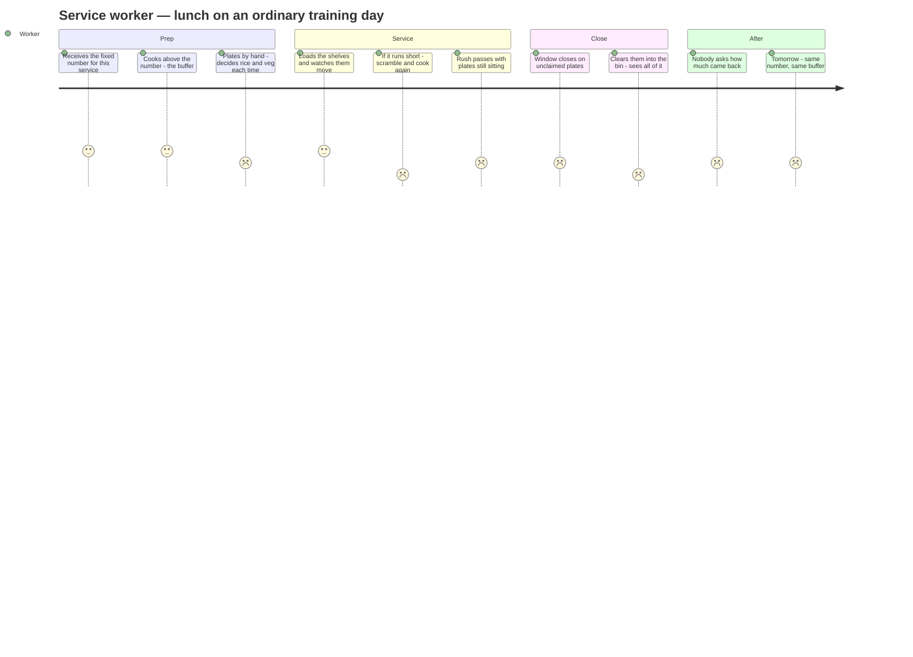

# Journey maps — the NSF and the cookhouse service worker

> **Revision 2 — 5 Sep 2026.** Rewritten against interview testimony. Rev 1 got three things wrong: it assumed the plating count was a running judgement (it is fixed per service), it assumed running out was unrecoverable (the kitchen simply cooks more), and it carried a forum claim that refill stations exist (they do not). It also missed the largest single finding — **the cookhouse deliberately cooks above the indent.**
>
> **Provenance.** `[T1]` participant's own NS experience · `[T2]` interview with a senior, 4 Sep 2026 · `[cited]` public source (§8) · `[weak]` forum-sourced · `[DERIVED]` implied by the above · `[ASSUMED]` still unverified.
>
> Interviewee kept unnamed per PDPA practice — logged separately in the People Log.

---

## 1. What makes a journey map good

From NN/g, the iDeA 1 method, and the SG Eco Loop framework deck — which agree on the shape.

**Five required elements:** one **actor** · a **scenario and expectations** · **journey phases** · **actions, mindsets and emotions** · **opportunities**.

**One persona per map.** Conflating two dissolves the narrative and nobody can act on it.

**Emotion is a single line across the phases** — the literal ups and downs. It is the only thing separating a journey map from the flowchart in `01-problem-map.md`, and the reason to draw one.

**The iDeA additions:** **touchpoint** (what they are doing) · **channel** (where, and in what context — the channel sets what is possible at that touchpoint) · **emotional response**. And the rule that matters: **the valleys are the design opportunities.**

**The framework deck's row template:** `Stage → User Action → Emotion → Core Friction`, with the tip that identifying the stages correctly is the whole job.

---

## 2. What the testimony changed

| # | Rev 1 assumption | Testimony `[T2]` | Consequence |
|---|---|---|---|
| J1 | Staff decide when to stop plating | **Numbers are fixed as a service** | The plate *count* is not a judgement. Rev 1's "refill anxiety" valley was wrong |
| J2 | Running out is an unrecoverable failure | **Running out = failure, and the cookhouse immediately cooks more** | **Under-supply is recoverable. Over-supply is not.** The asymmetry is sharper than drawn, and points the opposite way |
| J3 | — | **"If you input 100 they will cook more than 100."** Percentage unknown | **The indent is a floor, not a target.** A deliberate, unmeasured buffer sits on top of every service |
| J3b | — | **"Does everyone that scan eat? You have people who eat outside and ask others to help them scan"** | Proxy scanning confirmed. The scan record contains meals nobody attended |
| J3c | — | **"The cheat code is the numbers not enough, scan as out ration"** | When the count falls short, the classification is adjusted to make it tally |
| J4 | Unknown | **Assume nothing is counted** | No measurement anywhere |
| J5 | Refill stations exist for rice and veg `[weak]` | **No refill stations at all** | **A2 (seconds-availability) is dead.** The diner has zero recourse after taking the plate |
| J6 | Portion is a standing instruction | **Portion is the plater's judgement.** Countable items may have a guideline (2 fishcakes); **rice and veg quantity varies** | The plate *count* is fixed but the plate *contents* are discretionary — two different levers, two different people |
| J7 | Splittable by interview | **Cannot be quantified — "food not nice" or "too full", varies a lot** | W5 and W6 stay merged. Stop trying to separate them |

---

## 3. The finding this produced

Rev 1 said the waste came from a wrong forecast. It comes from **three compounding layers of over-provision, each individually rational, each invisible to the next.**

| Layer | Who | Why it is rational for them | Visible to the next layer? |
|---|---|---|---|
| **1 · The padded declaration** | The unit / food IC | Being short is visible and complained about the same day. Being over is not | No |
| **2 · The confirmed tally** | Meal accounting | Proxy scans and out-ration reclassification make the number come out right `[T2]` | No |
| **3 · The kitchen buffer** | The cookhouse | *"If you input 100 they will cook more than 100"* `[T2]` — because running out means cooking again under pressure | No — nobody knows the percentage |

**Each layer is a sensible local response to the same asymmetry: being short is loud, being over is silent.** Stack them and you get systematic over-production that no single person chose, nobody can see, and no one is accountable for.

> **Nobody in this chain is making a mistake. Each of the three is correctly solving the problem in front of them. The waste is what the three correct answers add up to.**

That is a much better pitch than "the forecast is wrong," and it came out of the interview, not the desk research.

---

## 4. MAP A — The NSF

**Actor.** A serviceman at a camp with a revamped self-serve cookhouse. Not a food IC, not a regular. Someone eating lunch.

**Scenario.** Lunch on an ordinary training day. Walks in with the platoon, ~30 minutes.

**Expectations.** Get fed, get out, get back in time. **Food is not the point of the day** — which means any solution demanding attention is competing with what they actually came to do.

| Stage | Action | Channel | Thinking | Emotion | Core friction |
|---|---|---|---|---|---|
| **1 · Before** | Morning activity; appetite builds or doesn't | Field, office, bunk | *"What's lunch?"* | Neutral → mild anticipation | **Appetite is set here, hours before the food is** `[DERIVED]` |
| **2 · The menu** | Word gets around | Word of mouth | *"Again?"* | **Dip** — fatigue | Knowing early changes nothing. There is no action attached to the information `[T1]` |
| **3 · Walking over** | Moves with the platoon | Corridor, parade square | *"Just get it done."* | Neutral, social | Arriving as a group means arriving as a surge `[ASSUMED]` |
| **4 · The scan** | Taps 11B — **sometimes for a friend eating outside** `[T2]` | The reader — **the only instrumented point in the building** | *"Scan for him also."* | **Dip** — mild complicity, routine | **The scan records entitlement, not eating.** Proxy scans and out-ration reclassification make it a record of compliance `[T2]` |
| **5 · The shelves** | Looks through the glass | The heated display | *"That one."* | Neutral — choice exists, but only between dishes | The choice is **which dish**, never **how much** `[cited]` |
| **6 · Taking the plate** | Opens the door, takes a plate | A two-second window in a moving queue | *"That's a lot of rice."* | **Dip** — resignation | **No mechanism, and no recourse. There are no refill stations** `[T2]`. Take less and you cannot top up; take the plate and the portion is final |
| **7 · Eating** | Eats what they want | Table, with friends, ~15 min | *"Not nice."* / *"I'm full."* | **Valley** | Two failures land identically and **cannot be separated** `[T2]`: didn't want it, and wanted less. Same plate, same bin |
| **8 · Scraping** | Tips the rest into the bin | Tray return — **public, in front of peers** | *"Everyone does it."* | **Deepest valley — guilt, instantly normalised** | Guilt is real and self-cancelling. Seeing everyone scrape converts waste into correct behaviour |
| **9 · Leaving** | Walks out | — | Nothing | Flat | **Nothing happens.** No feedback, no record, no consequence |

### What Map A reveals

**The valley is at 7–8; the cause is at 6.** By the time they feel anything, the portion has been fixed for minutes and the food cooked for hours. **Every incumbent — Winnow, Leanpath, Raccoon Eyes — intervenes at stage 8**, the one point where the actor has already lost all agency.

**Stage 4 is the system's only question, and it is the wrong one.** It asks *"are you entitled?"* It never asks *"how much do you want?"* The reader is installed, at the right moment, in front of the right person, pointed at the wrong question.

**Stage 6 is now worse than rev 1 described.** With no refill stations, the plate is not a starting point — it is the entire meal. There is no "take less and come back."

---

## 5. MAP B — The cookhouse service worker

**Actor.** Service staff employed by the catering contractor. Until recently they served onto trays at the front; they now work in the kitchen, plating and stocking the display shelves `[cited]`.

**Scenario.** Lunch service. Cook to the number plus a buffer, plate by hand, load the shelves, hold until the window closes.

**Expectations.** Everyone gets fed. **Do not be the reason someone goes hungry.**

| Stage | Action | Channel | Thinking | Emotion | Core friction |
|---|---|---|---|---|---|
| **1 · The number** | Receives the count for this service — **fixed** `[T2]` | The indent, set upstream days earlier | *"This is the number."* | Neutral, routine | **They did not set it and cannot question it.** The decision driving all downstream waste arrives as an instruction |
| **2 · The buffer** | Cooks **above** the number `[T2]` | Kitchen | *"Better to have extra."* | Mildly reassured | **The most consequential decision in the building, and nobody measures it.** *"Don't know the percentage"* `[T2]` |
| **3 · Plating** | Portions hundreds of plates by hand. Countables may have a rule; **rice and veg are their judgement** `[T2]` | The plating line — the new job `[cited]` | *"About that much."* | **Dip** — repetitive, high-volume, unguided | **A discretionary decision made hundreds of times a service, with zero feedback on whether it was ever right.** The only person calibrating it is the person who never learns the outcome |
| **4 · Loading** | Fills the heated display | The shelf, from behind | *"Enough out there?"* | Mild anticipation | The 4-hour hot-hold clock is running `[cited]` |
| **5 · The rush** | Watches the shelves move | The shelf — *"emptying fast"* `[cited]` | *"Holding up okay."* | Alert | The count is fixed, so this is watching, not deciding |
| **6a · If it runs short** | Kitchen **immediately cooks more** `[T2]` | Kitchen, under pressure | *"Go, now."* | **Sharp valley — scramble, stress, visible failure** | Loud, urgent, and **recoverable**. Somebody notices, and it gets fixed |
| **6b · If it doesn't** | Plates sit under the lamps | The shelf | *"Somebody might still come."* | Uneasy, then flat | Silent, and **not recoverable**. Nobody notices at all |
| **7 · Close** | Window closes; plates remain | The display | *"All of that."* | **Dip** | Past hot-hold it cannot be chilled, re-served or donated `[cited]`. The loss was locked in at stage 2 |
| **8 · Clearing** | Scrapes untaken plates into the bin | The bin, back of house — **seen by nobody else** | *"Every day."* | **Valley — futility** | **They are the only person in the chain who sees the whole loss.** The NSF sees one plate. This person sees all of it |
| **9 · After** | Cleans down, goes home | — | Nothing to report, nobody to report to | Flat | **No channel exists.** Assume nothing is counted `[T2]` |
| **10 · Tomorrow** | Same number, same buffer, same result | — | *"Same as always."* | Resigned | The system has no memory. Yesterday's bin does not touch today's pot |

### What Map B reveals

**The asymmetry is sharper than rev 1 drew it, and points the other way.**

| | Under-supply | Over-supply |
|---|---|---|
| Detected? | **Immediately** — someone is hungry | **Never** |
| Recoverable? | **Yes — the kitchen cooks more** `[T2]` | **No — past hot-hold, it is gone** `[cited]` |
| Costs whom? | The kitchen: stress, labour, a visible failure | Nobody who can see it |

**The system has a built-in remedy for the recoverable failure and none for the irreversible one.** That is exactly backwards, and it explains the buffer at stage 2 completely. The buffer is not carelessness — it is the rational purchase of insurance against the only failure anyone will notice.

**Stage 3 is the finding rev 1 missed entirely.** The plate count is fixed, but the rice and veg on each plate is a human judgement `[T2]`, repeated hundreds of times per service, by a person who never learns what came back. **That is a control loop with an actuator and no sensor — and it is the same shape as the food IC's problem, one level down.**

**The reframe for the pitch:**

> The kitchen worker is usually cast as the cause of the waste. They are **actually** the only witness to it — making a portioning judgement hundreds of times a day, and the only person in the building never told whether it was right.

---

## 6. Where the two journeys collide

**Map A stage 8 and Map B stage 8 are the same event.** The NSF scraping a plate and the worker clearing a shelf are looking at the same failure, minutes apart, twenty metres apart — **and neither knows the other is having it.**

**Their valleys have the same root and opposite shapes.** The NSF has too much food and **no way to say so**. The worker sends out too much food and has **no way to know**. One lacks a voice; the other lacks a sensor. **Two ends of a wire nobody connected.**

**And now, the sharper version.** Map B stage 3 is a *portioning decision*. Map A stage 6 is the *receipt of that decision*. They are separated by a pane of glass and about forty minutes — and the person deciding never sees the person receiving, or the bin afterwards. The system already has both halves of a feedback loop, in the same building, on the same shift.

**Where NOT to intervene, now visible from both maps:** both journeys end flat. That flat ending is the bin — where every existing product on the market operates, and the one point where both actors have already stopped being able to act.

---

## 7. The senior's challenge — and it lands

Two things from the interview that must not be quietly dropped:

> *"You can make the process of indenting easier and yet it does not solve the root cause, only the symptoms."* `[T2]`

**This is correct and it damages the previous plan's ranked intervention #1.** Handing the food IC a better tool does not change *why* they pad the number. The padding is a rational response to an asymmetry that a better indent form leaves completely intact. Easing the indent is symptom-level.

The senior also named the diagnostic:

> *"Level of Perspective by Daniel H. Kim. It is a tool to diagnose the real problem."* `[T2]`

Applied to this chain — leverage increases as you descend:

| Level | What is here | Leverage |
|---|---|---|
| **1 · Events** | Plates left over at lunch today | Lowest — reactive |
| **2 · Patterns** | Leftovers every service; the kitchen always cooks above the number | Low — this is what a smart bin measures |
| **3 · Systemic structures** | The three-layer buffer (§3). No feedback wire from bin to plater or to food IC. Under-supply recoverable, over-supply not | **High — this is where the previous plan was aiming** |
| **4 · Mental models** | *"Better to over-cook than run short."* *"The numbers must tally."* *"Camp food is bad, so waste is expected."* *"It's not my call."* | **Highest** |
| **5 · Vision** | — not yet articulated | — |

**The honest read:** the senior is right that indent-easing sits at level 2–3. But their own proposed root cause — *"sometimes camp food is bad"* — is a **level 4 mental model** and is also **contract-set, company-side, and immovable within this programme.** It explains W5 and nothing else: a cookhouse that cooks 110 for an indent of 100 wastes 10 portions no matter how good the food is.

**The genuinely level-4 target that this project can reach is the asymmetry itself** — *being short is loud, being over is silent.* Every one of the three layers exists because of it. Make over-provision as visible as under-provision, to the people already making the judgement, and the buffer has a reason to shrink. That is a better target than the indent, and the critique is what produced it.

---

## 8. What still needs verifying

| # | Question | For | How |
|---|---|---|---|
| **K1** | **What is the buffer percentage?** 5%? 20%? | **§3 layer 3 — the largest single unknown in the project** | Ask a cookhouse-duty NSF or a regular. Nobody has this number |
| **K2** | Roughly how many plates are left at window close? | Sizing the loss | An NSF can count from the diner's side — no equipment, no photography |
| **K3** | How often does a service actually run short? | Whether the buffer is buying anything | Interview |
| **K4** | Is the plating portion guideline written down, or learned? | Map B stage 3 — whether it is adjustable at all | Interview someone with cookhouse duty |
| **K5** | Does anyone ever tell the kitchen how much came back? | Map B stages 9–10 | Interview |
| **K6** | How common is proxy scanning? | §3 layer 2 | Interview — `[T2]` confirms it exists, not how much |

**K1 is now the highest-value question in the project.** *"They will cook more than 100"* is the whole finding, and *"don't know the percentage"* is the whole gap.

**K2 needs nothing but an NSF with a working memory.** Fastest route from `[ASSUMED]` to evidence available anywhere here.

---

## 9. Sources

| Claim | Source |
|---|---|
| Fixed service numbers; running short → cook more; cooking above the indent; proxy scanning; out-ration reclassification; no refill stations; plating portion discretionary for rice and veg; reasons for not finishing unquantifiable | Senior, NS, interviewed 4 Sep 2026 `[T2]` — logged in the People Log |
| IKEA-style pre-plated shelves; service staff moved to kitchen for plating and restocking; 16 cookhouses converted, all by 2028 | [PIONEER, 13 Sep 2024](https://defencepioneer.sg/pioneer-articles/13sep24_news1) · [MustShareNews](https://mustsharenews.com/saf-self-serve-shelves/) |
| Diner reaction to losing the ask-for-less mechanism `[weak]` | [HardwareZone forum](https://forums.hardwarezone.com.sg/threads/saf-cookhouses-have-self-serve-shelves-that-resemble-ikea-ordering-stations.7065588/) |
| 4-hour hot-hold limit at 5–60 °C; weekly forecast basis; ~1% figure | MINDEF releases — see `01-problem-map.md` §10 |
| Journey map anatomy; emotion as a single line; one persona per map | [NN/g — Journey Mapping 101](https://www.nngroup.com/articles/journey-mapping-101/) |
| Levels of Perspective — events, patterns, structures, mental models, vision | Daniel H. Kim, via `[T2]` |
| Stage / Action / Emotion / Friction template; double diamond | SG Eco Loop framework deck |
