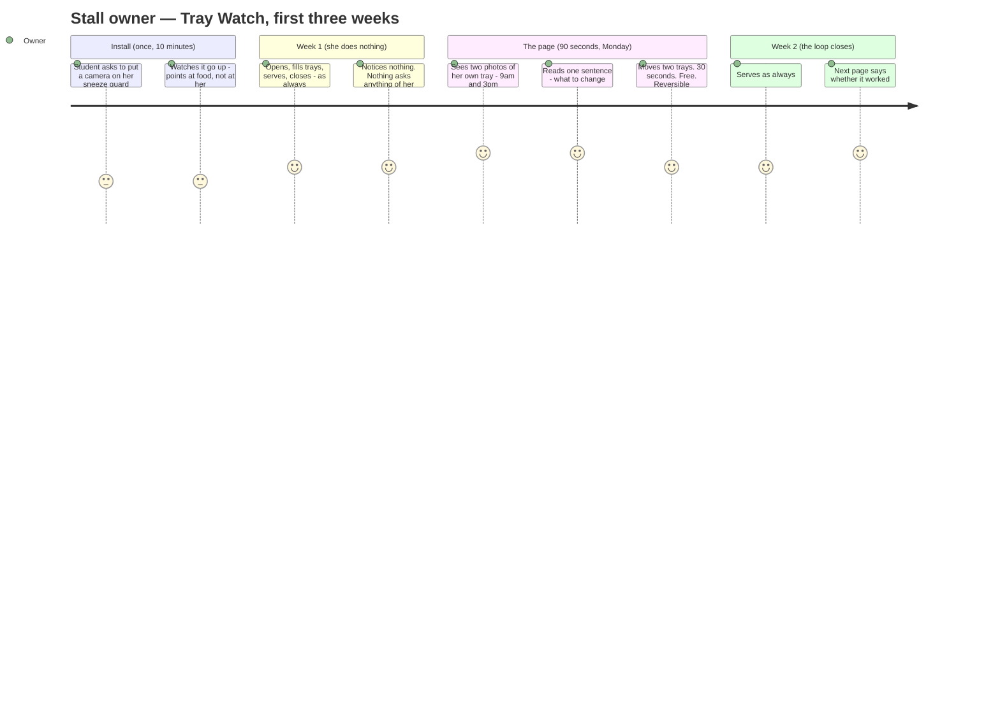
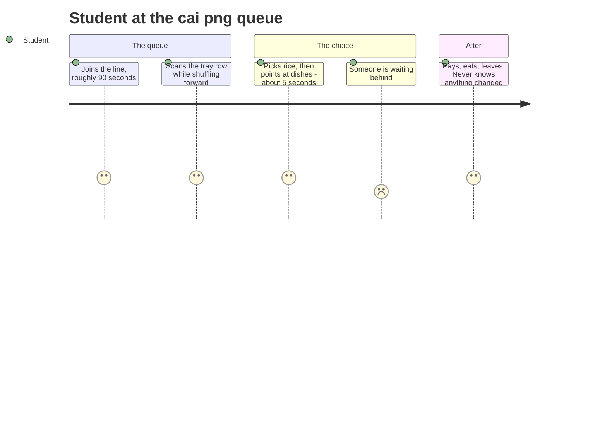

# User journey — Tray Watch

> **The question this document answers**, asked by Jamie Heng (SDTA) on 17 Sep and unanswered until
> now: *"what is the user journey?"*
>
> **Provenance.** `[testimony]` the stall owner, via Raghav, 17 Sep `[T3]` · `[cited]` public source ·
> `[DERIVED]` implied by cited facts · `[ASSUMED]` still needs fieldwork.
>
> **This supersedes one line in `04-hawker-journey-map.md`.** That file's header says *"No `[testimony]`
> yet — no hawker has been interviewed."* **That is no longer true.** She has been interviewed, and
> what she said is the reason Prototype 2 changed shape.

---

## 1. There are two people, and only one of them is the user

| | The stall owner | The student |
|---|---|---|
| **Role** | **The user.** She installs it, reads it, acts on it | **The mechanism.** Her sales move when their choices move |
| **Does she/he touch the product?** | Once a week, for ninety seconds | **Never. Does not know it exists** |
| **Who pays?** | Her, or the food court operator above her | Nobody |

**This matters and it is the answer to Jamie's question in one line.** A product whose "user" is
students has no buyer, no install path and no business model. The student's behaviour is the
*variable being moved*, not the customer being served. Everything below is her journey; §5 describes
the student's five seconds because that is the physics the product exploits.

**Actor.** The owner-operator of a cai png stall in the SUTD canteen. One to three people. Twelve-hour
days. English is not necessarily her first language `[ASSUMED]` — §4 is built around that.

**The problem she stated herself** `[testimony]`:

> *"vegetables often spoil because meat products sell fast… whereas vegetables sell slow… so she had
> to throw a lot of veggies, uncooked ones especially."*

She is not confused about her problem. She has named it exactly. **What she does not have is any way
to act on it**, because "vegetables sell slow" is a fact, not a decision.

---

## 2. The shape of the journey



**Read the middle section again.** For six days her emotional line is *flat*, and that is the design
achievement, not a gap in the map. `04-hawker-journey-map.md` §7: *"zero interaction during service,
zero manual data entry ever, survives being ignored."* A journey map where the user does nothing for
six days is what passing those constraints looks like.

**The entire product is ninety seconds on a Monday.** Everything else is machinery that exists to make
those ninety seconds true. Design budget should be spent accordingly.

---

## 3. The detail

| Stage | Her action | Channel | Thinking | Emotion | Design consequence |
|---|---|---|---|---|---|
| **0 · The ask** | Agrees to a camera above her trays | Face to face, at her stall | *"It points at the food, not at me?"* | Cautious, mildly amused | **Show her the crop, not a privacy policy.** The frame is cut to the tray row before anything is written to disk — she can see that on a phone screen in five seconds |
| **1 · Install** | Stands aside for ten minutes | Sneeze guard, one USB cable, one plug | *"Don't block my counter."* | Neutral | **Nothing on the counter, nothing in her way, no second plug she has to remember.** A grey card taped at the end of the tray row looks like a receipt and does the colour calibration (`05` §3.3) |
| **2 · Service, days 1–6** | **Nothing.** Opens, fills, serves, closes | — | *"…"* | **Flat, and deliberately so** | **Zero interaction is the whole constraint.** She has no free hands between 11 and 2 and never will `[cited]` |
| **3 · Close of day** | **Nothing.** Closes as always | — | *"…"* | Flat | **She is never asked to weigh, count or record anything.** The product reads the trays off the last frame of the day. Nothing is asked of her between install and the page |
| **4 · The page** | Reads one A4 sheet | Printed, handed over, Monday morning | *"That's my tray."* | **Peak — recognition, then surprise** | **See §4. This is the product.** |
| **5 · The change** | Moves two trays | The display, at open | *"Costs me nothing to try."* | Willing, low stakes | **Free, 30 seconds, fully reversible.** Anything that fails one of those three does not get done |
| **6 · The verification** | Reads next Monday's page | Same sheet, one week later | *"So it did work."* | **Trust, or a corrected belief** | **This step is what makes it a product instead of a report.** Without it she has an opinion about a student's project; with it she has an instrument |

---

## 4. The page — the ninety seconds the whole build serves

**It is two photographs and one sentence.**

```
┌─────────────────────────────────────────────────────┐
│  KANGKONG — Tuesday                                 │
│                                                     │
│   [ photo: her tray at 9:05am ]   [ 3:02pm ]        │
│        full                          still 60%      │
│                                                     │
│  You cooked about 3 trays. You sold about 1.        │
│                                                     │
│  ► Put the kangkong between the curry chicken       │
│    and the tofu tomorrow.                           │
└─────────────────────────────────────────────────────┘
```

Four properties, each load-bearing:

**It is her own stall.** `04-hawker-journey-map.md` §7 closes: *"the measurement has to be theirs, not
yours — a number they trust because it came off their own stall, not a claim in a slide."* Two
photographs of her own tray, four hours apart, are not a claim. They are the thing itself. **A load
cell could never have produced this** — that is the single strongest argument for the pivot.

**It needs almost no English.** Two pictures and an arrow carry the finding. The sentence is a
courtesy, not the payload. This is not a nicety; it is the difference between a product she uses and a
document she is polite about.

**There is exactly one recommendation.** Not five. Five recommendations get zero of them done — she
has twelve-hour days and no slack for a ranked list. The LLM call (`05` §5.5) is constrained to her
levers *and* to picking one.

**The recommendation is free, fast and reversible.** Moving two trays costs nothing, takes thirty
seconds, and can be undone tomorrow. Compare *"cook 10% less kangkong"* — that costs money if it is
wrong, and running out is the one outcome she will not accept `[DERIVED]`.

---

## 5. The student's five seconds — the mechanism, not the user



The choice is **visual, fast, and made under mild social pressure** `[ASSUMED]` — the queue behind is
real and it shortens deliberation. Three similar greens in a row do not read as three options at that
speed; they read as one green thing. **That is the entire hypothesis Tray Watch tests**, and `05` §3
turns it into a number computed from the photographs themselves.

**The student is never asked anything, shown anything, or told anything.** No app, no poster, no QR
code, no "eat your greens" signage. This matters for two reasons: signage interventions fight an
absence of pain (`03-hawker-5w1h.md` §8), and anything requiring student participation dies the week
the novelty does.

---

## 6. Where this journey breaks

Honest failure modes, all of them about her rather than the hardware:

| Break | Why | Mitigation |
|---|---|---|
| **The page is longer than one side of A4** | Twelve-hour days. She will accept it politely and not read it | Hard cap: two photos, one sentence, one change |
| **The recommendation costs money** | Margin is 10–15% `04` §4. Anything with a price attached is a no | Only the free levers: L1, L3, L4 |
| **It is not reversible** | She will not gamble a day's takings on a student's chart | Only same-day-undoable changes |
| **She refuses the rearrangement (N1)** | It is her display and her instinct about it is twenty years old | **Ask before mounting anything.** If she says no, the system still measures — it just cannot run the experiment, and the claim drops to observation only |
| **Week 2 never happens** | The hackathon ends 2 Oct; the verification loop needs a second week | **Say so.** Run week 1 inside the deadline and present the loop as designed and one turn demonstrated. Do not imply two weeks of data exist |
| **She stops caring after the novelty** | Every deployed sensor eventually gets ignored | Nothing to maintain, nothing to charge, nothing to tap. It survives being ignored by design `04` §7 |

---

## 7. How the journey changes at scale

For one stall, Raghav is the install, the labeller and the page. That does not scale, and the pitch
should not pretend otherwise.

**The scale-up buyer is not the stall.** It is the food court operator — Koufu, Kopitiam, Fei Siong —
who controls fit-out, already runs sustainability reporting, and can deploy forty cameras in one
decision. Their journey is different and shorter: one contract, one install crew, one dashboard
across forty stalls, and the per-stall page arrives by phone instead of on paper.

**The stall owner's ninety seconds stay exactly the same.** That is the test of whether the design
holds: the thing the operator buys is the fleet, and the thing that makes it work is still two
photographs and one sentence.

---

## 8. The answer for Jamie, in one paragraph

> A camera goes on the stall's sneeze guard, pointed down at the food. For six days it photographs the
> display trays every two minutes and the stall owner does nothing at all — no screen, no app, nothing
> to tap, no free hands required, because she has none between 11 and 2. At the end of the week she
> gets one sheet of paper: a photo of her tray at 9am, the same tray at 3pm, and one sentence saying
> which dish to move next to which. She makes the change in thirty seconds; it costs nothing and she
> can undo it tomorrow. **The following week the system tells her whether it worked.** She is the
> user. The students are the mechanism — they never see the product, they just see a display that has
> been rearranged so the vegetables stop blending into each other.
